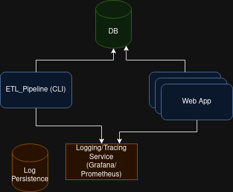

# acetl

Another CSV Extract-Transform-Load Application!

## Technical details

* Python: 3.10.13
* database: Postgres

## Usage example (Locally)

Assuming you have cloned the repository,
use the docker-compose to launch a database instance:

```commandline
docker compose up
```

Generate some dummy data using etl cli app

```commandline
python cli.py --help 
python cli.py generate-dummy-data
```

Use the cli application to do ETL

```commandline
python cli.py etl-single-file data/retail_data_medium.csv
python cli.py etl-multiple-files /data
```

Note: make sure to install these dependencies if you are working locally (linux)
```commandline
#for postgres psycopg2 driver
apt update && apt install -y build-essential libpq-dev
```

You can run the web application and check it at `http://localhost:8000/docs`

```commandline
python main.py
```

## Kubernetes Architecture Diagram




## Done

* ETL “Extract – Transform – Load” pipeline that ingests 1 or multiple CSV files into a Database
* A simple REST API that exposes the recently ingested data:
  •Description: Returns the first 10 lines from Database
  •Request: Get /read/first-chunck
  •Response: 200 OK
  •Response Body: JSON
  •Response Body Description: A list of 10 JSON objects

## TODO

* update and improve docstrings
* improve logging/tracing
* add github actions pipeline for tests
* improve Kubernetes Architecture Diagram

## references

* https://dev.to/ken_mwaura1/getting-started-monitoring-a-fastapi-app-with-grafana-and-prometheus-a-step-by-step-guide-3fbn
